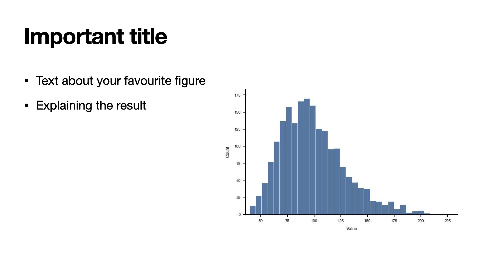
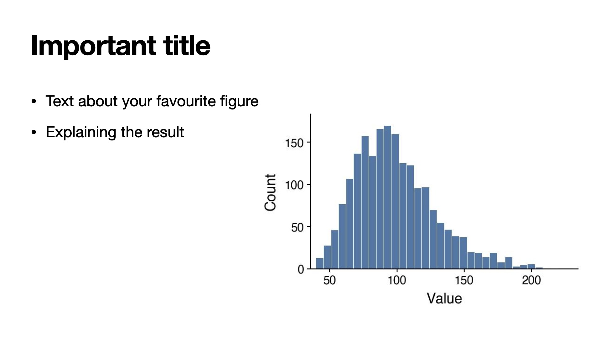
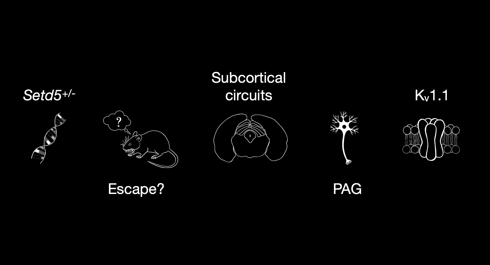
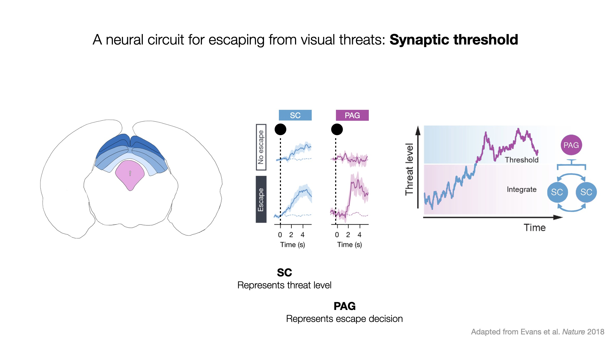
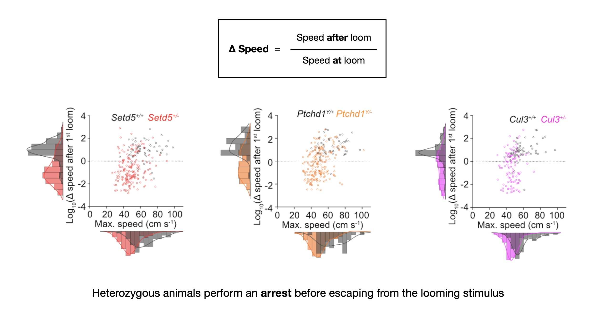

During my time in research labs I have given my fair share of presentations. 

At times during my PhD I wondered whether the frequency with which I was made to present my work was slightly excessive. However, looking back now I'm incredibly grateful for the opportunity to receive such regular, constructive feedback. I learnt a great deal from that time, and I want to share some of it here. This is not an exhaustive list, but tips that I come back to regularly and think about whenever I'm creating a presentation.

1. **Use a (much) larger font size in your figures than you think you need.** 
In my opinion, this is the most undervalued thing you can do to improve your presentation. It is so easy, and yet I still see *so* many presentations where people include graphs with tiny fonts that make the plots effectively useless. If someone can't read the axis labels or values they have no way of interpreting the data in the graph and are relying on you to describe it in detail.

    You've gone to all the effort to design and run an experiment and collect and analyse the data only to undermine it at the last step. I think this flaw stems from the process of creating single figures to begin with and not thinking about how they might be used in the future.

    I agree that initially creating a plot with very large font can look a bit silly when you're looking at it by itself, but when embedded into a slide, it will make all the difference. Help yourself and others: increase that font size.  

{width=80%}

{width=80%}

2. **Find out the size of the room and the screen on which you will present.**
This is related to the point above. When designing a presentation, you're often told to think about your audience and what you want the take-home messages to be, but rarely are you told to consider the size of the room or the screen that you will be using. These two details will determine how you should structure your slides. I was recently at a conference where I was watching a presentation in a very large space, with a comparatively very small screen. The presenter's slides would have been great in a normal seminar room / lecture hall situation, but in this case most people could barely see any of the details on the slides.

3. **Repeat yourself more than feels natural.** I think it's hard to make things too clear to an audience. As an audience member, I really appreciate it when the speaker takes the time to recap and rephrase what the key points are. Even the best of us struggle to keep up with everything a presenter has said. Including an outline slide at the beginning of the presentation and coming back to that throughout is a useful way to help the viewer anchor themselves at different stages of the talk.

4. **Don't end your presentation on an acknowledgements slide.** The last visual that you present during a talk is precious. It is your last chance to recapture the attention of the audience and leave them with what you think the key take-home messages are. It doesn't have to include text; a key plot, a diagram or a related graphic will all do a better job at making sure the content of your presentation sticks than a list of the people involved.

    Acknowledgement slides are important, but they shouldn't be the last thing the audience sees. By ending on a summary slide you're also helping the audience by reminding them of the talk's content and giving them prompts to come up with questions.  

{width=80%}

5. **Don't leave something dynamic playing while you talk.** Videos and dynamic elements (GIFs etc.) are good, but can be quite distracting. I'm easily distracted by a looping GIF, like a dog spotting a squirrel. Play it once or twice to get the point across, then stop it. 

6. **Result slide titles should be a statement.** Not a hard and fast rule, but it is often good to have the title of your slide a statement describing the key result shown on that slide. Really, when making a presentation you want to make it as easy as possible for someone watching to follow along. Be generous to your audience and factor in the fact that someone will definitely have dropped off or become distracted somewhere and you want them to be able to catch up as quickly as possible.

    Clear titles also help people who are still learning the language of the talk, since many people read a foreign language more easily than they follow it spoken.

7. **Pictures (and plots) really are worth 1,000 words.** It's a cliché for a reason. Good presentations are largely about storytelling and nothing helps grab and guide people quite like a suitable picture. Large blocks of text, in my opinion, are rarely ever needed. 

8. **Use colour sparingly and with purpose.** Cohesion is key. As someone who studied the neuroscience behind saliency for quite some years, I can tell you that colour can really grab our attention. This is a great thing in small doses, but can quickly become chaotic and overwhelming if you're not careful. 

{width=80%}

{width=80%} 

9. **Be decisive and intentional with your laser pointer.** A supervisor once gave me this advice, and now I can't help noticing it in other people's talks. The advice was, when using a laser pointer try not to wave it around; a single clean, crisp point or circle of the thing you are trying to highlight is much more convincing than a drawn-out wave around the screen. It's also better than trying to hold the laser pointer still at something because the magnification of the laser pointer also amplifies how much your hand is shaking (see point below). 

10. **Try to relax and enjoy it.** Of course, this is easier said than done but I find it helpful to remind myself that people enjoy presentations *wayyy* more if the presenter comes across as relaxed. You don't have to actually *be* 100% relaxed, but try your hardest to remember you're not saving lives and most people are really rooting for you to do well. 