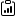
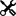
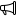

A selection of my research, the tools I've built, and outreach work.
[Hover over a card to preview it — click to read more.]{.projects-hint}

##  Research projects

```{=html}
<div class="project-stack">

  <a class="project-item" href="connectome.html">
    <h3 class="project-item-title">Male <i>Drosophila</i> Visual System Connectome</h3>
    <div class="project-tags">
      <span class="tag tag-domain">Connectome</span>
      <span class="tag tag-domain">Visual Neuroscience</span>
      <span class="tag">Python</span>
      <span class="tag">Snakemake</span>
      <span class="tag">Blender</span>
      <span class="tag">Graph DB</span>
      <span class="tag">neuPrint</span>
      <span class="tag tag-year">2023-2025</span>
    </div>
    <div class="project-desc"><p>Computational analysis and 3D visualization of the <i>Drosophila</i> optic lobe connectome.</p></div>
  </a>

  <a class="project-item" href="freely-walking-optomotor.html">
    <h3 class="project-item-title">Behavioural characterisation of walking fruit flies to visual stimuli</h3>
    <div class="project-tags">
      <span class="tag tag-domain">Visual Neuroscience</span>
      <span class="tag">Behaviour</span>
      <span class="tag">MATLAB</span>
      <span class="tag">Automation</span>
      <span class="tag">Group dynamics</span>
      <span class="tag">High-throughput</span>
      <span class="tag tag-year">2023-2026</span>
    </div>
    <div class="project-desc"><p>Pipeline for designing, performing and analysing behavioural experiments within an LED arena.</p></div>
  </a>

  <a class="project-item" href="nested-rf.html">
    <h3 class="project-item-title">2-step protocol for investigating neural responses to motion</h3>
    <div class="project-tags">
      <span class="tag tag-domain">Visual Neuroscience</span>
      <span class="tag">MATLAB</span>
      <span class="tag">Python</span>
      <span class="tag">Signal Processing</span>
      <span class="tag">Experimental Design</span>
      <span class="tag tag-year">2024-2026</span>
    </div>
    <div class="project-desc"><p>Electrophysiology toolkit that dynamically generates stimuli based on real-time neural response analysis.</p></div>
  </a>

  <a class="project-item" href="burnett-2024.html">
    <h3 class="project-item-title">Investigating rapid, visually-driven decision making in mouse models of autism</h3>
    <div class="project-tags">
      <span class="tag tag-domain">Visual Neuroscience</span>
      <span class="tag">MATLAB</span>
      <span class="tag">Data analysis</span>
      <span class="tag">Decision-making</span>
      <span class="tag">Autism</span>
      <span class="tag">Subcortical circuits</span>
      <span class="tag">Innate behaviour</span>
      <span class="tag tag-year">2018-2023</span>
    </div>
    <div class="project-desc"><p>A study on shared visual perception and avoidance deficits across genetically distinct autism mouse models.</p></div>
  </a>

  <a class="project-item" href="madm.html">
    <h3 class="project-item-title">Investigating Lgl1 function in brain development with MADM</h3>
    <div class="project-tags">
      <span class="tag tag-domain">Developmental Neuroscience</span>
      <span class="tag">Molecular</span>
      <span class="tag">MADM</span>
      <span class="tag">Genetics</span>
      <span class="tag">RNAseq</span>
      <span class="tag tag-year">2016</span>
    </div>
    <div class="project-desc"><p>Used the genetic tool Mosaic Analysis with Double Markers (MADM) to determine the role of Lgl1 in cortical development.</p></div>
  </a>

  <a class="project-item" href="enteric.html">
    <h3 class="project-item-title">Characterising the enteric nervous system in the <i>nNOS<sup>&minus;/&minus;</sup></i> mouse model</h3>
    <div class="project-tags">
      <span class="tag tag-domain">Developmental Neuroscience</span>
      <span class="tag">Molecular</span>
      <span class="tag">qPCR</span>
      <span class="tag">Confocal</span>
      <span class="tag tag-year">2015-2016</span>
    </div>
    <div class="project-desc"><p>Generated a cellular and molecular profile of the enteric nervous system before stem cell transplant.</p></div>
  </a>

</div>
```

##  Tools

```{=html}
<div class="project-stack">

  <a class="project-item" href="neuview.html">
    <h3 class="project-item-title">neuView — Interactive Neuron Type Explorer</h3>
    <div class="project-tags">
      <span class="tag tag-domain">Python</span>
      <span class="tag">NeuPrint</span>
      <span class="tag">Jinja2</span>
      <span class="tag">CLI</span>
      <span class="tag">Caching</span>
      <span class="tag tag-year">2024-2026</span>
    </div>
    <div class="project-desc"><p>Python CLI tool that generates interactive HTML pages for neuron types using data from NeuPrint, with intelligent caching and multi-dataset support.</p></div>
  </a>

  <a class="project-item" href="reiser-documentation.html">
    <h3 class="project-item-title">Lab Documentation Website</h3>
    <div class="project-tags">
      <span class="tag tag-domain">Documentation</span>
      <span class="tag">Quarto</span>
      <span class="tag">Jinja2</span>
      <span class="tag">Python</span>
      <span class="tag tag-year">2025-2026</span>
    </div>
    <div class="project-desc"><p>Comprehensive documentation website for experiments run in the Reiser Lab.</p></div>
  </a>

</div>
```

##  Outreach

```{=html}
<div class="project-stack">

  <a class="project-item" href="optical-illusions-summer-camp.html">
    <h3 class="project-item-title">Optical Illusions Summer Camp</h3>
    <div class="project-tags">
      <span class="tag tag-domain">Outreach</span>
      <span class="tag">Visual Neuroscience</span>
      <span class="tag tag-year">2021-2022</span>
    </div>
    <div class="project-desc"><p>Placeholder description — a summer camp introducing students to the neuroscience of optical illusions.</p></div>
  </a>

</div>
```
